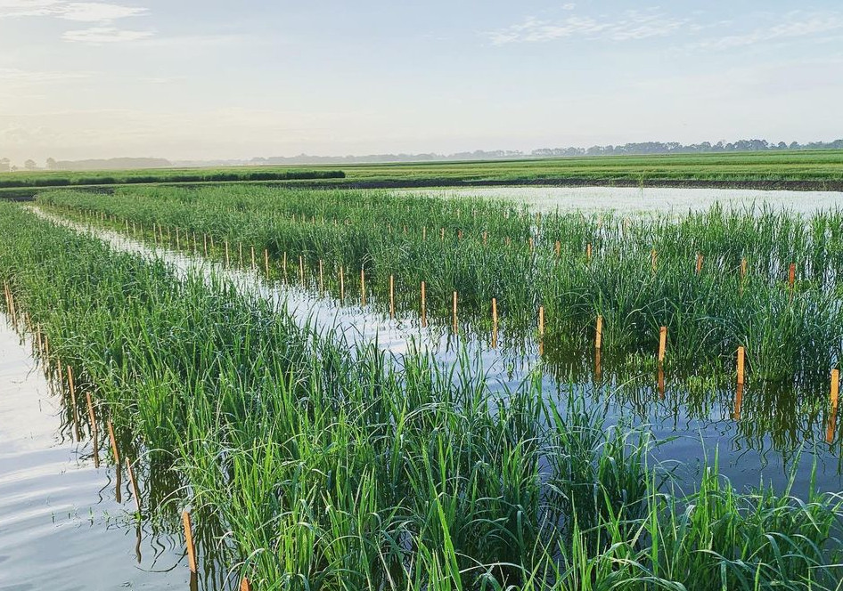
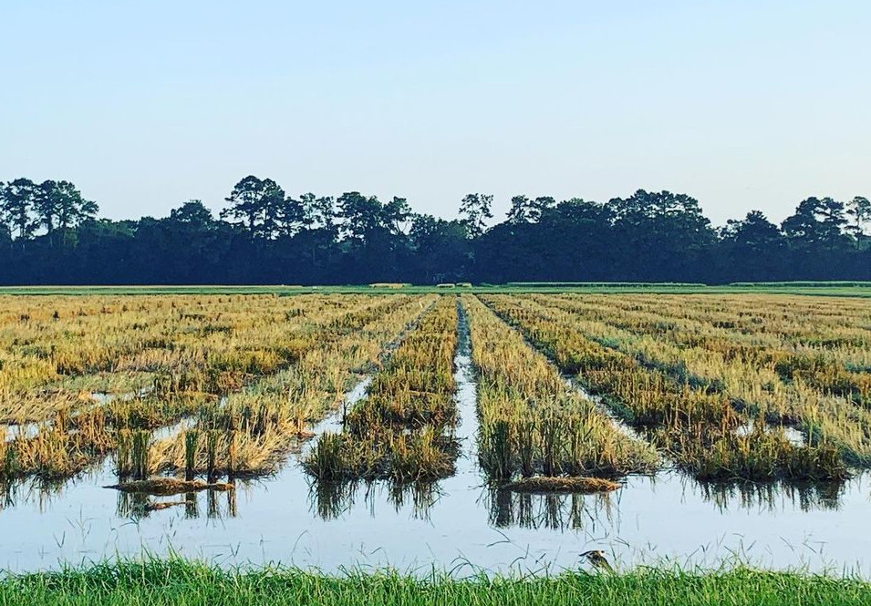

## The Field Program
The breeding project develops conventional and 
herbicide-resistant long-grain, medium-grain and specialty rice varieties such as 
aromatic rices and new lines tailored to the [Latin American market](https://www.lsuagcenter.com/articles/page1606255285126){:target="_blank"}. 
Development of herbicide resistant lines includes Clearfield varieties and new
[Provisia lines](https://www.ricefarming.com/departments/feature/new-and-improved-2/){:target="_blank"}.

In one year, we evaluate approximately 60,000-70,000 experimental or 
progeny rows, 300 F1 transplants and 250 space-planted F2 populations. About 
200-300 new crosses are made each year. Data are collected on about 10,000 yield
plots comprising the preliminary yield trials (PYTs), regional yield trials 
(RYTs), and the commercial advanced trials (CAs). The PYT represents the first 
stage of plot-level testing and consists of two reps at 1 location with 
thousands of lines. Selections are advanced to multi-location trials as part of 
the RYT, and, finally, top candidates are evalulated for multiple years at many 
locations as part of the CA. Our extensive testing ensures only the very best 
are released to farmers as new varieties.

**Each year we make 400-500 crosses and plant 300 new F1 populations. Bulked F2
 seed will be advanced in our Puerto Rico winter nursery or in the greenhouse 
 for marker assisted selection.**

In addition to our breeding tests, we also conduct the date-of-planting study
and participate in the Uniform Regional Rice Nursery (URRN). 
The date-of-planting study has been planted at our research station for over 
twenty years and is aimed at analyzing the effects planting date has on key 
quality and agronomic traits. The URRN is a cooperative trial between us and 
programs at Arkansas, Mississippi, Texas, California and Missouri. This 
across-state test provides valuable insight into the broad adaptation of our 
lines across the United States.

We evaluate many traits on our test plots. Important traits include agronomic 
traits such as plant height, maturity, yield, and ratoon yield. In additon to 
agronomic traits, we select on a number important milling and quality traits, 
and we also work to incorporate a good disease resistance package into all of 
our lines when possible.

**Harvested plots are flooded again to evaluate the ratoon capacity of 
experimental lines. A large percentage of rice along the Gulf Coast is ratooned, 
in which the rice is harvested for a second crop. Prior to flooding the stubble 
is manipulated to stimulate regrowth and nitrogen fertilizer is flown on.**

In conjunction with our field program, we have established a SNP DNA marker lab 
to incorporate molecular breeding approaches into variety development efforts. 
The use of whole-genome markers for genomic selection (GS) is also an active 
area of research for us. These efforts increase the efficiency and effective 
size of our program, but at the end of the day there is no subsitute for a good, 
well-managed field trial. Our field program is as important as ever!

## Our Marker Lab

In 2016, with support from the Louisiana Rice Research Board,
we established a state-of-the-art DNA marker lab at the Rice Research Station. 
This lab is run using the LGC SNPline genotyping platform, and is ideal for
routine breeding applications that include many samples (10,000s) run on 
few DNA markers (1-20). The lab has a capacity of 40,000 data points a day, can 
be operated by a single person, and has a cost as low as 2 cents per data point. 
This lab has enabled the large-scale implementation of DNA markers for 
marker-assisted selection, pedigree validation, and variety purification. 

A significant effort is put forth to genetic discovery,
marker development, and marker validation for use in applied breeding efforts. 
[read more](research)

<iframe width="600" height="315" src="https://www.youtube.com/embed/X1KVyTKxnOs" frameborder="0" allow="accelerometer; autoplay; clipboard-write; encrypted-media; gyroscope; picture-in-picture" allowfullscreen></iframe>

## Variety Releases
The Rice Research Center publishes a comprehensive variety  management report 
featuring recent data on current rice varieties. This report is freely available 
and can be accessed by clicking on the the "Varieties" link on the
[AgCenter rice homepage](https://www.lsuagcenter.com/topics/crops/rice){:target="_blank"}.

### 2021 Rice breeding update

<iframe width="600" height="315" src="https://www.youtube.com/embed/BIVIod1qHZc" frameborder="0" allow="accelerometer; autoplay; clipboard-write; encrypted-media; gyroscope; picture-in-picture" allowfullscreen></iframe>

### Selected Release Publications

Famoso, A.N., Harrell, D.L., Groth, D.E., Kongchum, M., Wenefrida, I., Oard, 
J.H., Zaunbrecher, R.E., Bearb, K.F., Conner, C.A., Guidry, G.J., Angira, B., 
Sha, X. and Linscombe, S.D. 2019. Registration of **‘CLJ01’** Rice. 
Journal of Plant Registrations
[doi:10.3198/jpr2018.06.0035crc](https://doi.org/10.3198/jpr2018.06.0035crc){:target="_blank"}

Famoso, A.N., Harrell, D.L., Groth, D.E., Webster, E.P., Oard, J.H., 
Zaunbrecher, R.E., Bearb, K.F., Conner, C.A., Guidry, G.J., Angira, B., White, 
L.M. and Linscombe, S.D. 2019. Registration of **‘PVL01’** Rice. 
Journal of Plant Registrations
[doi:10.3198/jpr2019.01.0002crc](https://doi.org/10.3198/jpr2019.01.0002crc){:target="_blank"}

Famoso, A.N., Oard, J.H., Harrell, D.L., Groth, D.E., Bearb, K.F., White, L.M., 
Zaunbrecher, R.E., Linscombe, S.D. 2016. Registration of **'CL153'** Rice. 
Journal of Plant Registrations
[doi:10.3198/jpr2016.04.0023crc](https://doi.org/10.3198/jpr2016.04.0023crc){:target="_blank"} 

Famoso, A.N., Oard, J.H., Harrell, D.L., Groth, D.E., Bearb, K.F., White, L.M., 
Zaunbrecher, R.E., Linscombe, S.D. 2016. Registration of **'CL272'** Rice. 
Journal of Plant Registrations
[doi:10.3198/jpr2016.04.0024crc](https://doi.org/10.3198/jpr2016.04.0024crc){:target="_blank"} 
