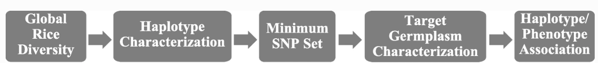
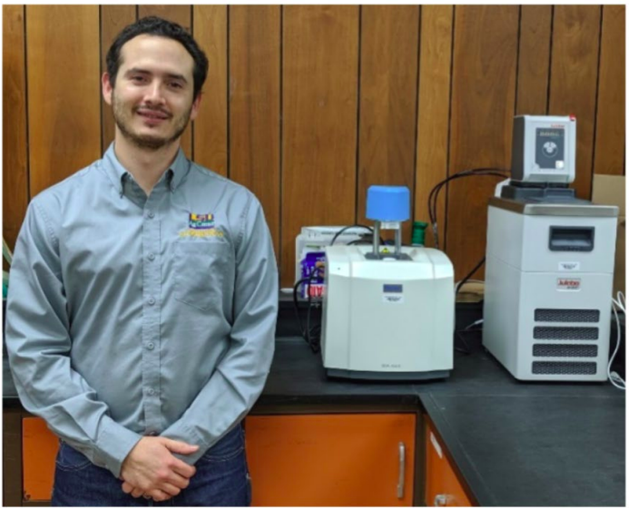
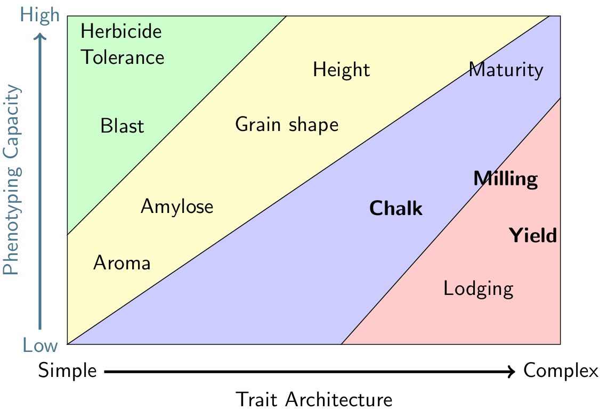

## Overview
As a university breeding program, it is our mandate to
conduct high quality peer-reviewed research. 
The emphasis of our research is on developing and validating 
new technologies and breeding approaches 
within the logistical context of an applied breeding program.

## Characterizing the diversity in US rice

Although rice has served as a model organism for decades and many genes have been
characterized and cloned, much of this work has been conducted outside of elite
US germplasm. We leaverage the wealth of genomics data available in the rice 
community to pinpoint markers for testing in our breeding germplasm. 
From there we identify key haplotypes and develop SNP assays 
that can be used for marker assisted selection in our program.

**Converting rice knowledge into markers that accelerate the production of new 
varieties**

Our approach has proved fruitful and has led to the development of markers 
for a multitude of quality, agronomic, and disease traits. Our work includes 
characterizing the 
[sd1](https://doi.org/10.3835/plantgenome2019.02.0010){:target="_blank"}
gene for semidawf stature and exploring
[BADH2](https://doi.org/10.1186/s12284-020-00410-7){:target="_blank"}
haplotype variation underlying aroma in US rice.

## Speciality rice for Latin markets

**PhD student Raul Guerra is working to improve rice for the Latin American 
export market.**

Tastes change over time and it's our duty to make sure we are developing rice 
cultivars that not only produce for farmers, but also meet the demands of the 
consumer. Export to Central America is a key market for US rice farmers; 
however, exports have declined due changing perceptions of grain quality in 
these regions. We are working on developing quantitative methods that can 
be used to understand the grain qualities desired in Latin markets. Once we 
understand the heritable fraction of these quality traits, we can fastlane the 
development of varieties that meet quality standards.

## Realizing the potential of genome-wide markers

**Breeding methods are dictated by phenotyping capacity and genetic 
complexity. Traits in the bottom right of this chart are prime targets for 
genomic prediction.**

Maker assisted selection can lead to big gains for traits with a simple
genetic architecture like plant height, but often fails to deliver for 
polygenic traits like yield or chalkiness. In the early 2000s, statistical 
methods for utilizing whole-genome markers to predict complex 
traits--like yield--were developed and their use has since become mainstream in 
industry breeding programs for high budget crops. We are investigating the use 
of genomic prediction within our program in collaboration with the
[Robbins Lab](https://blogs.cornell.edu/robbinslab/){:target="_blank"} 
at Cornell University. 
[read more](https://www.lsuagcenter.com/articles/page1576790438910){:target="_blank"}

## Selected research publications

Check out our
[Google Scholar](https://scholar.google.com/citations?hl=en&user=Fm9E8xAAAAAJ&view_op=list_works&sortby=pubdate){:target="_blank"}

Addison, C.K., Angira, B., Cerioli, T., Groth, D.E., Richards, J.K., Linscombe, S.D., and **Famoso, A.N**. Identification and mapping of a novel resistance gene to the rice pathogen, Cercospora janseana. Theor Appl Genet. 2021.[10.1007/s00122-021-03821-2](https://doi.org/10.1007/s00122-021-03821-2){:target="_blank"} 

Cerioli, T., Gentimis, T., Linscombe, S.D, **Famoso, A.N**. Effect of rice planting date and optimal planting window for Southwest Louisiana. Agronomy Journal. 2021.[10.1002/agj2.20593](https://doi.org/10.1002/agj2.20593){:target="_blank"} 

Addison, C.K., Angira, B., Kongchum, Harrell, D.L., Baisakh, N., Linscombe, S.D.,
and **Famoso, A.N.**. Characterization of Haplotype Diversity in the BADH2 Aroma 
Gene and Development of a KASP SNP Assay for Predicting Aroma in U.S. Rice. 2020.
Rice 
[10.1186/s12284-020-00410-7](https://doi.org/10.1186/s12284-020-00410-7){:target="_blank"}

Angira, B., Addison, C.K., Cerioli, T., Rebong, D.B., Wang, D.R., Pumplin, N., 
Ham, J.H., Oard, J.H., Linscombe, S.D. and **Famoso, A.N.** 2019.
Haplotype Characterization of the sd1 Semidwarf Gene in United States Rice. 
The Plant Genome. 
[10.3835/plantgenome2019.02.0010](https://doi.org/10.3835/plantgenome2019.02.0010){:target="_blank"}

